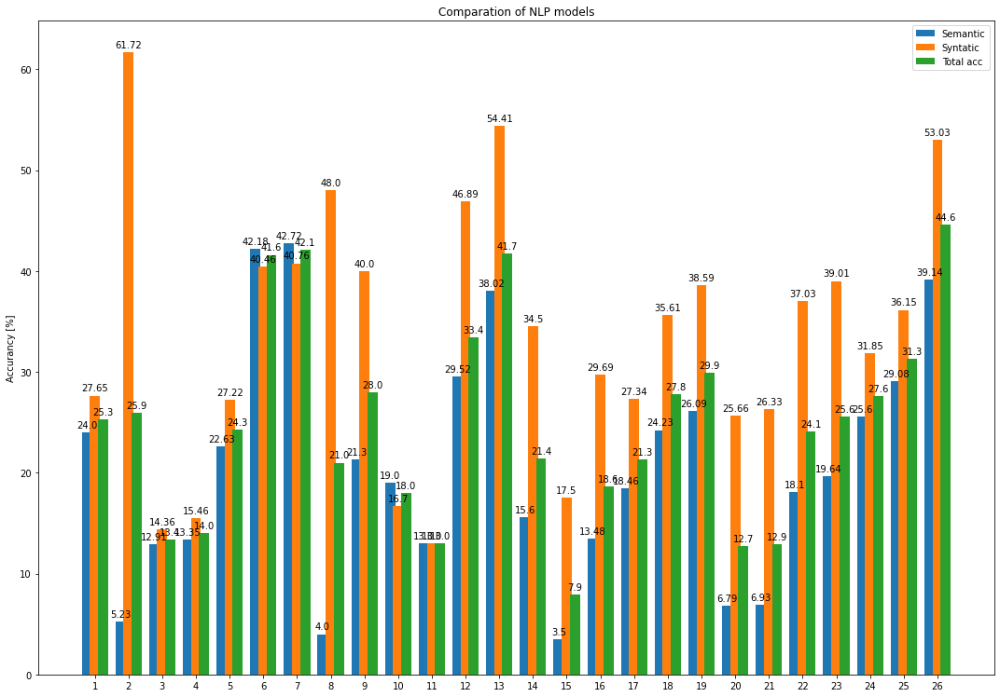
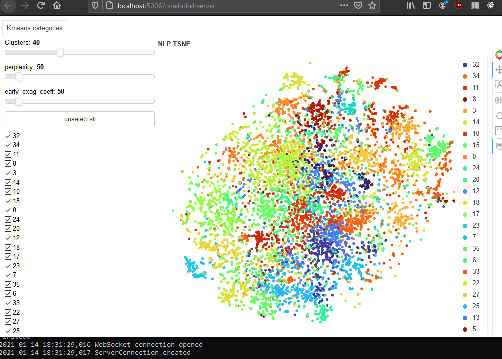

## Word2Vec

### Word2Vec trained with [Gensim 4](https://github.com/RaRe-Technologies/gensim)  

Evaluating word analogies for top 300000 words in the model on questions-words-pl.txt  

10/10 plwiki [plwiki](https://dumps.wikimedia.org/plwiki/20210101/plwiki-20210101-pages-articles-multistream.xml.bz2)  
corpus of 1008640 documents with 291075342 positions (total 2349518 articles, 304757007 positions before pruning articles shorter than 50 words)  
lr = 0.025, context_window = 10, dim = 300, epoch = 5, minCount = 40  

Type | Value
------------ | -------------
capital-common-countries | 54.7% (277/506)  
capital-world | 42.9% (5045/11772)  
city-in-state | 78.8% (104/132)  
currency | 2.7% (16/600)  
family | 53.1% (223/420)  
gram1-adjective-to-adverb | 6.2% (50/800)  
gram2-opposite | 19.7% (30/152)  
gram3-comparative | 45.2% (393/870)  
gram4-superlative | 20.6% (104/506)  
gram5-present-participle | 20.2% (142/702)  
gram6-nationality-adjective | 82.9% (1359/1640)  
gram7-past-tense | 17.9% (10/56)  
gram8-plural | 27.6% (368/1332)  
gram9-verb-aspect | 32.1% (18/56)  
Quadruplets with out-of-vocabulary words | 20.5%  
***Semantic*** | 42.18% (5665/13430) 
***Syntactic*** | 40.46% (2474/6114)   
**Total accuracy** | 41.6% (8139/19544)  

**Word2Vec** - [300d (Google Drive)](https://drive.google.com/file/d/1Vm9P5TmCd2PUsQiZNj976F7u1gpZzr4i/view?usp=sharing)

1/10 plwiki [plwiki](https://dumps.wikimedia.org/plwiki/20210101/plwiki-20210101-pages-articles-multistream1.xml-p1p187037.bz2)  
62382 articles, 1158218 unique tokens, 40486171 corpus positions  
lr = 0.025, context_window = 10, dim = 300, epoch = 5, minCount = 40  

Type | Value
------------ | -------------
capital-common-countries | 33.1% (139/420)  
capital-world | 22.0% (1323/6006)  
city-in-state | 36.4% (48/132)  
currency | 2.4% (11/462)  
family | 42.4% (145/342)  
gram1-adjective-to-adverb | 5.8% (34/588)  
gram2-opposite | 13.0% (7/54)  
gram3-comparative | 50.9% (235/462)  
gram4-superlative | 24.3% (51/210)  
gram5-present-participle | 7.6% (16/210)  
gram6-nationality-adjective | 30.7% (504/1640)  
gram8-plural | 28.8% (304/1056)  
gram9-verb-aspect | 20.0% (6/30)  
Quadruplets with out-of-vocabulary words | 52.7%  
***Semantic*** | 22.63% (1666/7362)   
***Syntactic*** | 27.22% (1157/4250)   
**Total accuracy** | 24.3% (2823/11612)

**Word2Vec** - [300d (Google Drive)](https://drive.google.com/file/d/16Y6rQW3i8bWDe48tOiZi44uzYkUmFjUN/view?usp=sharing)

1/10 plwiki [plwiki](https://dumps.wikimedia.org/plwiki/20210101/plwiki-20210101-pages-articles-multistream1.xml-p1p187037.bz2)  
lr = 0.025, context_window = 5, dim = 100, epoch = 5, minCount = 5  

Type | Value
------------ | -------------
capital-common-countries | 25.9% (131/506)  
capital-world | 12.2% (1491/12210)  
city-in-state | 18.2% (24/132)  
currency | 1.2% (9/756)  
family | 37.1% (156/420)  
gram1-adjective-to-adverb | 4.2% (31/744)  
gram2-opposite | 5.6% (10/178)  
gram3-comparative | 33.0% (287/870)  
gram4-superlative | 10.8% (70/650)  
gram5-present-participle | 2.8% (21/756)  
gram6-nationality-adjective | 18.8% (309/1640)  
gram7-past-tense | 0.9% (1/110)  
gram8-plural | 13.9% (185/1332)  
gram9-verb-aspect | 5.3% (7/132)  
Quadruplets with out-of-vocabulary words | 16.8%  
***Semantic*** | 12.91% (1811/14024) 
***Syntactic*** | 14.36% (921/6412) 
**Total accuracy** | 13.4% (2732/20436)

1/10 plwiki [plwiki](https://dumps.wikimedia.org/plwiki/20210101/plwiki-20210101-pages-articles-multistream1.xml-p1p187037.bz2)   
lr = 0.025, context_window = 5, dim = 300, epoch = 5, minCount = 5  

Type | Value
------------ | -------------
capital-common-countries | 27.3% (138/506)  
capital-world | 12.6% (1541/12210)  
city-in-state | 18.2% (24/132)  
currency | 1.3% (10/756)  
family | 37.9% (159/420)  
gram1-adjective-to-adverb | 5.1% (38/744)  
gram2-opposite | 5.6% (10/178)  
gram3-comparative | 38.9% (338/870)  
gram4-superlative | 9.8% (64/650)  
gram5-present-participle | 4.1% (31/756)  
gram6-nationality-adjective | 18.8% (309/1640)  
gram7-past-tense | 0.9% (1/110)  
gram8-plural | 14.6% (195/1332)  
gram9-verb-aspect | 3.8% (5/132)  
Quadruplets with out-of-vocabulary words | 16.8%   
***Semantic*** | 13.35% (1872/14024) 
***Syntactic*** | 15.46% (991/6412)  
**Total accuracy** | 14.0% (2863/20436)

## FastText

### FastText trained with [Gensim 4](https://github.com/RaRe-Technologies/gensim)  

10/10 plwiki [plwiki](https://dumps.wikimedia.org/plwiki/20210101/plwiki-20210101-pages-articles-multistream.xml.bz2)  
lr = 0.025, context_window = 10, dim = 300, epoch = 5, minCount = 40, maxn = 0  

Type | Value
------------ | -------------
capital-common-countries | 56.9% (288/506)  
capital-world | 43.4% (5105/11772)  
city-in-state | 78.0% (103/132)  
currency | 2.2% (13/600)  
family | 54.3% (228/420)  
gram1-adjective-to-adverb | 6.6% (53/800)  
gram2-opposite | 19.7% (30/152)  
gram3-comparative | 47.1% (410/870)  
gram4-superlative | 21.5% (109/506)  
gram5-present-participle | 19.4% (136/702)  
gram6-nationality-adjective | 82.4% (1351/1640)  
gram7-past-tense | 21.4% (12/56)  
gram8-plural | 28.0% (373/1332)  
gram9-verb-aspect | 32.1% (18/56)  
Quadruplets with out-of-vocabulary words | 20.5%  
***Semantic*** | 42.72% (5737/13430) 
***Syntactic*** | 40.76% (2492/6114)   
**Total accuracy** | 42.1% (8229/19544)

**FastText w/o char n-grams** - [300d (Google Drive)](https://drive.google.com/file/d/1QvZaaL4xAXTjrwVxO8HlyjKbTUiDwNb8/view?usp=sharing)  

1/10 plwiki [plwiki](https://dumps.wikimedia.org/plwiki/20210101/plwiki-20210101-pages-articles-multistream1.xml-p1p187037.bz2)  
lr = 0.025, context_window = 10, dim = 300, epoch = 5, minCount = 40, maxn = 0  

Type | Value
------------ | -------------
capital-common-countries | 33.8% (142/420)  
capital-world | 23.7% (1423/6006)  
city-in-state | 36.4% (48/132)  
currency | 3.2% (15/462)  
family | 40.6% (139/342)  
gram1-adjective-to-adverb | 6.3% (37/588)  
gram2-opposite | 27.8% (15/54)  
gram3-comparative | 50.2% (232/462)  
gram4-superlative | 20.5% (43/210)  
gram5-present-participle | 8.6% (18/210)  
gram6-nationality-adjective | 34.2% (561/1640)  
gram8-plural | 24.6% (260/1056)  
gram9-verb-aspect | 30.0% (9/30)  
Quadruplets with out-of-vocabulary words | 52.7%   
***Semantic*** | 24.00% 1767/7362 
***Syntactic*** | 27.65% 1175/4250
**Total accuracy** | 25.3% (2942/11612)

**FastText w/o char n-grams** - [300d (Google Drive)](https://drive.google.com/file/d/1DnjUrgFAGOsn1KnQzFN9WuiDdujpZKml/view?usp=sharing)

1/10 plwiki [plwiki](https://dumps.wikimedia.org/plwiki/20210101/plwiki-20210101-pages-articles-multistream1.xml-p1p187037.bz2)  
lr = 0.025, context_window = 10, dim = 300, epoch = 5, minCount = 40  

Type | Value
------------ | -------------
capital-common-countries | 16.4% (69/420)  
capital-world | 3.9% (234/6006)  
city-in-state | 12.9% (17/132)  
currency | 0.4% (2/462)  
family | 18.4% (63/342)  
gram1-adjective-to-adverb | 46.9% (276/588)  
gram2-opposite | 88.9% (48/54)  
gram3-comparative | 68.0% (314/462)  
gram4-superlative | 54.3% (114/210)  
gram5-present-participle | 81.9% (172/210)  
gram6-nationality-adjective | 84.0% (1377/1640)  
gram8-plural | 29.8% (315/1056)  
gram9-verb-aspect | 23.3% (7/30)  
Quadruplets with out-of-vocabulary words | 52.7%   
***Semantic*** | 5.23% 385/7362 
***Syntactic*** | 61.72% 2623/4250 
**Total accuracy** | 25.9% (3008/11612)

**FastText** - [300d (Google Drive)](https://drive.google.com/file/d/130fq6453T36j-VEkTGjQGgem3SWZ_FCJ/view?usp=sharing)

### FastText trarined with [FastText 0.9.2](https://github.com/facebookresearch/fastText)  

1/10 plwiki [plwiki](https://dumps.wikimedia.org/plwiki/20210101/plwiki-20210101-pages-articles-multistream1.xml-p1p187037.bz2)  
model = 'skipgram', lr = 0.05, context_window = 5, dim = 100, epoch = 5, minCount = 5  

Type | Value
------------ | -------------
***Semantic*** | ~21.3% (3274/15346)  
***Syntactic*** | ~40% (3698/9224)   
**Total accuracy** | ~28% (6972/24570)  

1/10 plwiki [plwiki](https://dumps.wikimedia.org/plwiki/20210101/plwiki-20210101-pages-articles-multistream1.xml-p1p187037.bz2)  
model = 'cbow', lr = 0.05, context_window = 5, dim = 100, epoch = 5, minCount = 5  

Type | Value
------------ | -------------
***Semantic*** | ~4% (675/15346)   
***Syntactic*** | ~48% (4448/9224)   
**Total accuracy** | ~21% (5123/24570)  Case sensitivity ~14% (3515/24570)  

1/10 plwiki [plwiki](https://dumps.wikimedia.org/plwiki/20210101/plwiki-20210101-pages-articles-multistream1.xml-p1p187037.bz2)  
model = 'skipgram', lr = 0.025, context_window = 10, dim = 300, epoch = 5, minCount = 40, maxn = 0  

Type | Value
------------ | -------------
***Semantic*** | ~19% (2942/15346)  
***Syntactic*** | ~16.7% (1543/9224)   
**Total accuracy** | ~18% (4485/24570)  

1/10 plwiki [plwiki](https://dumps.wikimedia.org/plwiki/20210101/plwiki-20210101-pages-articles-multistream1.xml-p1p187037.bz2)  
model = 'cbow', lr = 0.025, context_window = 10, dim = 300, epoch = 5, minCount = 40, maxn = 0  

Type | Value
------------ | -------------
***Semantic*** | ~13% (2054/15346)   
***Syntactic*** | ~13% (1195/9224)   
**Total accuracy** | ~13% (3249/24570)

### Comparation of NLP models

1#FastText skipgram  w/o char n-grams lr 0.025 context window 10 dim 300 epoch 5 minCount 40 maxn 0 buckets 2000000 t 0.001  
2#FastText skipgram char n-grams lr 0.025 context window 10 dim 300 epoch 5 minCount 40 minn 3 maxn 6 buckets 2000000 t 0.001  
3#Word2Vec lr 0.025 context window 5 dim 100 epoch 5 minCount 5  
4#Word2Vec lr 0.025 context window 5 dim 300 epoch 5 minCount 5  
5#Word2Vec lr 0.025 context window 10 dim 300 epoch 5 minCount 40  
6#Word2Vec lr 0.025 context window 10 dim 300 epoch 5 minCount 40  
7#FastText skipgram  w/o char n-grams lr 0.025 context window 10 dim 300 epoch 5 minCount 40 maxn 0 buckets 2000000 t 0.001  
8#FastText cbow lr 0.05 context window 5 dim 100 epoch 5 minCount 5 minn 3 maxn 6 buckets 2000000 t 0.0001  
9#FastText skipgram lr 0.05 context window 5 dim 100 epoch 5 minCount 5 minn 3 maxn 6 buckets 2000000 t 0.0001  
10#FastText skipgram lr 0.025 context window 10 dim 300 epoch 5 minCount 40 maxn 0 buckets 2000000 t 0.0001  
11#FastText cbow lr 0.025 context window 10 dim 300 epoch 5 minCount 40 maxn 0 buckets 2000000 t 0.0001  
12# [glove_100_3_polish](https://github.com/sdadas/polish-nlp-resources/releases/download/v1.0/glove.zip)  
13# [glove_300_3_polish](https://github.com/sdadas/polish-nlp-resources/releases/download/glove-hd/glove_300_3_polish.zip.001)  
[http://dsmodels.nlp.ipipan.waw.pl](http://dsmodels.nlp.ipipan.waw.pl)  
14#wiki-forms-all-100-cbow-ns-30-it100.txt  
15#wiki-forms-all-100-cbow-hs  
16#wiki-forms-all-100-cbow-ns.txt  
17#wiki-forms-all-100-skipg-hs.txt  
18#wiki-forms-all-100-skipg-ns  
19#wiki-forms-all-100-skipg-ns-30-it100  
20#wiki-forms-all-300-cbow-hs  
21#wiki-forms-all-300-cbow-hs-30  
22#wiki-forms-all-300-cbow-ns  
23#wiki-forms-all-300-cbow-ns-30  
24#wiki-forms-all-300-skipg-hs  
25#wiki-forms-all-300-skipg-ns  
26#nkjp+wiki-forms-all-300-skipg-ns-50  

### Bokeh server + TSNE + Kmeans clustering

